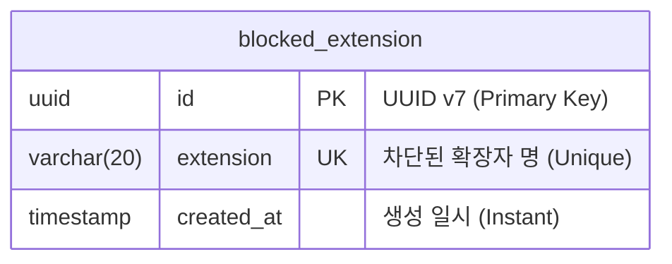

# ERD 설계 (Mermaid)

## 설명
* **blocked_extension**: 차단된 확장자 목록을 저장하는 테이블입니다.
  * `id`: PK, UUID v7을 사용합니다.
  * `extension`: 차단할 파일 확장자입니다. 중복될 수 없으며, 최대 20자입니다.
  * `created_at`: 데이터가 생성된 시점입니다.
* **참고**: 고정 확장자와 커스텀 확장자를 구분하는 별도의 컬럼을 두지 않고, 비즈니스 로직에서 고정 확장자 목록(`bat`, `cmd` 등)과 비교하여 구분합니다. DB에 존재하면 `차단됨` 상태로 간주합니다.